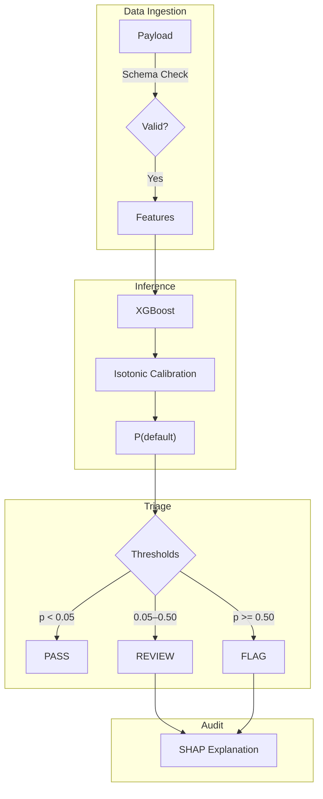

# Failure-Aware ML System

<div align="center">

**Fail-Safe Classification | Human-in-the-Loop | Minimize False Negatives**

[](https://www.python.org/downloads/)
[](LICENSE)
[](https://wilsebbis.github.io/failure-aware-ml-system)

[**Documentation**](https://wilsebbis.github.io/failure-aware-ml-system) ·
[Quick Start](#60-second-demo) ·
[Architecture](#architecture)

</div>

---

## What Is This?

Failure-Aware ML System is a **high-recall risk scoring engine** for regulated environments. It takes tabular input data and outputs a three-way decision:

| Decision | Trigger | Outcome |
|----------|---------|---------|
| ✅ **PASS** | Calibrated probability < 0.05 | Auto-approved |
| ⚠️ **REVIEW** | 0.05 ≤ probability < 0.50 | Routed to human reviewer |
| 🚨 **FLAG** | Probability ≥ 0.50 | Auto-blocked |

This is **not** a fully automated decision system. It routes uncertain cases to humans rather than forcing a bad automated decision.

> **Demo Dataset**: This repo uses the [UCI Credit Card Default](https://archive.ics.uci.edu/dataset/350/default+of+credit+card+clients) dataset for reproducibility. The architecture is dataset-agnostic—swap in your own features via `src/data/load.py`.

---

## 60-Second Demo

### Sample Payload

```json
{
  "LIMIT_BAL": 50000, "SEX": 2, "EDUCATION": 2, "MARRIAGE": 1, "AGE": 32,
  "PAY_0": 2, "PAY_2": 0, "PAY_3": 0, "PAY_4": 0, "PAY_5": 0, "PAY_6": 0,
  "BILL_AMT1": 48000, "BILL_AMT2": 45000, "BILL_AMT3": 42000,
  "BILL_AMT4": 40000, "BILL_AMT5": 38000, "BILL_AMT6": 36000,
  "PAY_AMT1": 2000, "PAY_AMT2": 1500, "PAY_AMT3": 1000,
  "PAY_AMT4": 1000, "PAY_AMT5": 1000, "PAY_AMT6": 1000
}
```

### Expected Output

```
Decision: FLAG
Calibrated Probability: 0.73

Top Contributing Features:
  +0.23  PAY_0 = 2 (payment delay)
  +0.12  utilization_ratio = 0.96
  +0.08  max_delay = 2

Audit Artifact: /outputs/case_12345_explanation.md
```

### Run It

```bash
git clone https://github.com/wilsebbis/failure-aware-ml-system.git
cd failure-aware-ml-system
uv sync
uv run python -m src.main
```

---

## Architecture



---

## Key Metrics: Safety First Calibration

The model struggled to cleanly separate middle-risk cases (common with this dataset). Rather than forcing bad automated decisions, we tuned the **PASS threshold aggressively low** (p < 0.05).

### The Critical Metric: Pass Queue Defect Rate

| Metric | Value | Meaning |
|--------|-------|--------|
| **Pass Queue Defect Rate** | 1.8% | Only 1.8% of auto-approved cases are actual defaults |
| System Recall (FLAG + REVIEW) | 98.2% | 98% of defaults go to human eyes |

### Triage Distribution

| Queue | Volume | Contains |
|-------|--------|----------|
| ✅ PASS | 18% | Safe cases only (1.8% defect rate) |
| ⚠️ REVIEW | 68% | Uncertain cases → human decision |
| 🚨 FLAG | 14% | High-risk → auto-blocked |

> **Design Philosophy**: We accept higher review volume in exchange for a pristine PASS queue. The 1.8% defect rate means automation only touches cases we're confident about.

### Model Calibration

| Model | ECE | Calibration |
|-------|-----|-------------|
| XGBoost | 0.016 | Isotonic |

---

## Explainability

Failure-Aware ML System generates explainability artifacts that **can support compliance workflows** (GDPR, FCRA). These are audit aids, not legal compliance by themselves.


See [Generating Explanations](docs/guides/explanations.md) for details.

---

## Documentation

📖 **[Full Documentation](https://wilsebbis.github.io/failure-aware-ml-system)**

| Section | Description |
|---------|-------------|
| [Confidence & Calibration](docs/concepts/confidence.md) | Precise metric definitions |
| [Threshold Derivation](docs/concepts/thresholds.md) | How we compute thresholds |
| [Queue Mechanics](docs/concepts/queue.md) | Feedback loops & retraining |
| [API Reference](docs/api/index.md) | Module documentation |
| [Model Card](docs/model_card.md) | Limitations & ethics |

---

## Supported Datasets

The system uses an **Adapter Pattern** to support multiple professional datasets:

| Dataset | Skill Demonstrated | Size |
|---------|-------------------|------|
| **UCI Credit** | Baseline (single CSV) | 3MB |
| **Home Credit** | Data engineering (7-table joins) | 800MB |
| **IEEE-CIS Fraud** | ML Ops (temporal splits, 339 features) | 1.2GB |
| **Lending Club** | Business value (IRR optimization) | 1.5GB |

### Download Datasets

```bash
# Install Kaggle CLI
pip install kaggle

# Download all datasets
python scripts/download_data.py --dataset all

# Or download specific dataset
python scripts/download_data.py --dataset home_credit
```

### Run with Different Datasets

```bash
# Default (UCI Credit)
uv run python -m src.main

# Home Credit (multi-table joins)
uv run python -m src.main --dataset home_credit

# IEEE-CIS (temporal splits)
uv run python -m src.main --dataset ieee_cis

# Lending Club (IRR optimization)
uv run python -m src.main --dataset lending_club
```

---

## Project Structure

```
failure-aware-ml-system/
├── src/
│   ├── data/
│   │   ├── adapters/       # Dataset-specific loaders
│   │   │   ├── base.py         # Abstract interface
│   │   │   ├── home_credit.py  # 7-table ETL
│   │   │   ├── ieee_cis.py     # Temporal splits
│   │   │   └── lending_club.py # IRR calculation
│   │   └── factory.py      # Adapter registry
│   ├── config/             # YAML configs per dataset
│   ├── models/             # Logistic, RF, XGBoost
│   ├── evaluation/         # Metrics, calibration
│   ├── explainability/     # SHAP explanations
│   ├── decision_policy/    # Three-way triage
│   └── monitoring/         # Drift detection
├── scripts/
│   └── download_data.py    # Kaggle data fetcher
├── docs/                   # MkDocs documentation
└── data/raw/               # Downloaded datasets
```

---

## Development

```bash
# Run tests
uv run pytest tests/ -v

# Generate SHAP figures
uv run python scripts/generate_shap_figures.py

# Build docs locally
mkdocs serve
```

---

## License

MIT License - See [LICENSE](LICENSE) for details.
