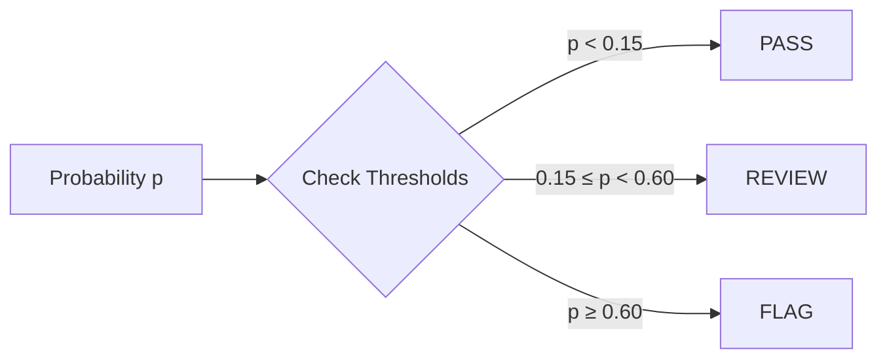

# Decision Policy API

The decision policy module implements the three-way triage system.

---

## TriagePolicy

::: src.decision_policy.triage.TriagePolicy
    options:
      show_root_heading: true
      members_order: source

---

## Usage Example

```python
from src.decision_policy.triage import TriagePolicy
import numpy as np

# Initialize with thresholds
policy = TriagePolicy(
    threshold_negative=0.15,
    threshold_positive=0.60
)

# Apply to probability array
probabilities = np.array([0.05, 0.35, 0.75, 0.42])
decisions = policy.decide(probabilities)

print(decisions)
# ['PASS', 'REVIEW', 'FLAG', 'REVIEW']

# Get statistics
stats = policy.get_statistics(decisions)
print(stats)
# {'pass_rate': 0.25, 'review_rate': 0.50, 'flag_rate': 0.25}
```

---

## Decision Logic



---

## Configuration

Thresholds are configurable via `src/config.py`:

```python
@dataclass
class DecisionConfig:
    threshold_negative: float = 0.15  # PASS ceiling
    threshold_positive: float = 0.60  # FLAG floor
```

---

## Related

- [Threshold Derivation](../concepts/thresholds.md)
- [Queue Mechanics](../concepts/queue.md)
