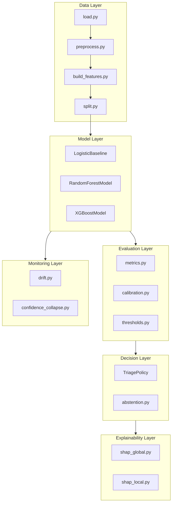

# System Architecture

This page provides a deep dive into the system's design decisions.

---

## Design Philosophy

### Fail Loudly, Not Quietly

The worst outcome in high-stakes classification is a **silent false negative**—a risky case that slips through undetected. Sentinel is designed to:

1. **Maximize recall** at the expense of precision
2. **Route uncertainty to humans** rather than guessing
3. **Generate audit trails** for all non-trivial decisions

### Why Not Deep Learning?

| Criterion | Tree Ensembles | Neural Networks |
|-----------|----------------|-----------------|
| Interpretability | TreeExplainer (exact) | Approximation only |
| Calibration | Reliable with isotonic | Often overconfident |
| Small data | Strong (<100k rows) | Weak without pretraining |
| Audit friendliness | Feature importance | Black box |

For datasets <1M rows in regulated environments, tree models dominate.

---

## Component Architecture



---

## Data Flow

### Training Pipeline

```
Raw CSV → Schema Validation → Preprocessing → Feature Engineering
    → Train/Val/Test Split → Model Training → Calibration → Save
```

### Inference Pipeline

```
Payload → Validation → Preprocessing → Features → Model.predict_proba
    → Calibration → Triage → Decision + Explanation
```

---

## Key Design Decisions

### 1. Column Renaming (UCI Dataset)

The UCI Credit Card Default dataset uses X1-X23 column names. We map these to semantic names in `load.py`:

```python
column_mapping = {
    "X1": "LIMIT_BAL",
    "X2": "SEX",
    # ... etc
}
```

### 2. Ordinal vs. One-Hot Encoding

- **PAY_0 through PAY_6**: Kept as ordinal (delay months)
- **EDUCATION, MARRIAGE**: One-hot encoded (no ordinal relationship)

### 3. Three-Way vs. Binary Decision

Traditional binary classifiers force a decision. Sentinel introduces an **abstention region** where the model admits uncertainty and defers to humans.

---

## Related

- [Confidence & Calibration](confidence.md)
- [Threshold Derivation](thresholds.md)
- [Queue Mechanics](queue.md)
