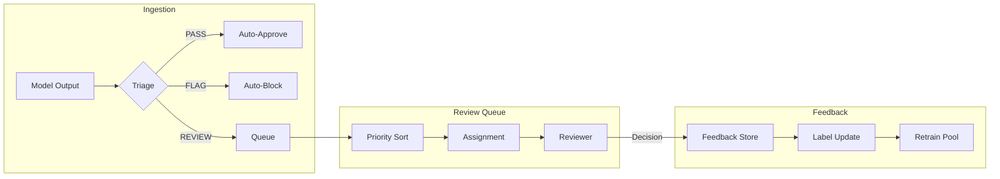
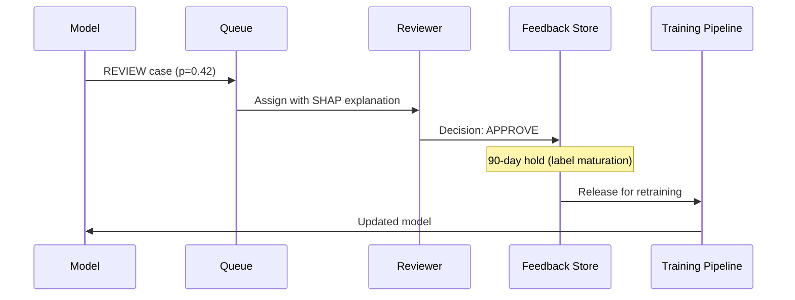
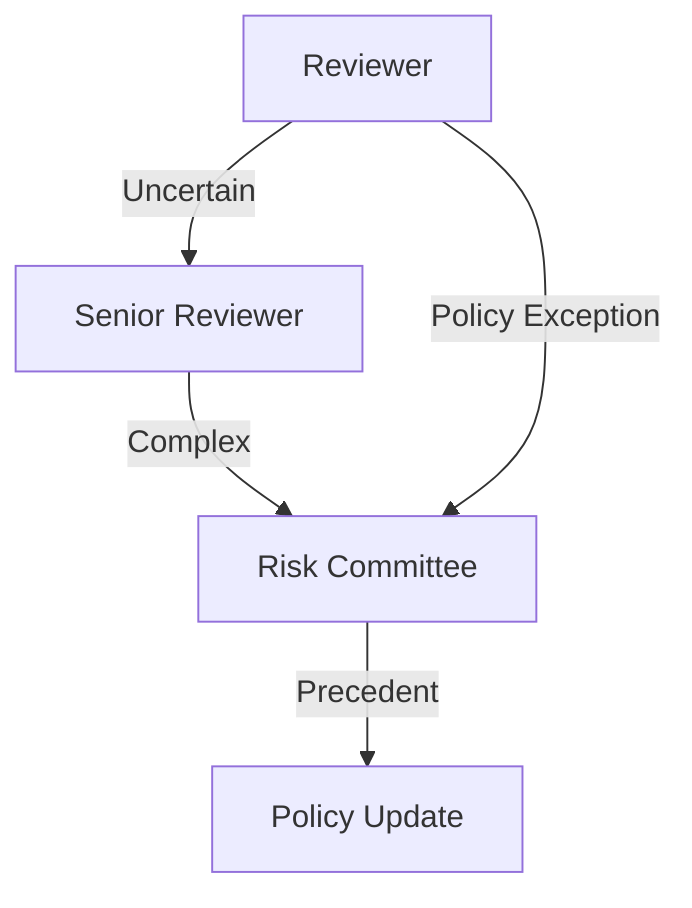

# Queue Mechanics & Reviewer Operations

This page describes the human review queue, capacity planning, and feedback governance.

---

## Queue Architecture



---

## Queue Prioritization

Cases are prioritized by **proximity to thresholds** (most uncertain first):

```python
def priority_score(proba, threshold_neg=0.15, threshold_pos=0.60):
    """
    Higher score = higher priority (more uncertain).
    Cases near the midpoint of abstention band are prioritized.
    """
    midpoint = (threshold_neg + threshold_pos) / 2
    distance_from_edge = min(
        proba - threshold_neg,
        threshold_pos - proba
    )
    return distance_from_edge
```

| Priority | Condition | Rationale |
|----------|-----------|-----------|
| **High** | 0.35 ≤ p < 0.45 | Maximum uncertainty |
| **Medium** | 0.25 ≤ p < 0.35 or 0.45 ≤ p < 0.55 | Moderate uncertainty |
| **Low** | Edge cases near thresholds | Model was almost confident |

---

## Capacity Planning

### Key Metrics

| Metric | Definition | Target |
|--------|------------|--------|
| **Queue depth** | Active cases awaiting review | < 500 |
| **SLA compliance** | % reviewed within 4 hours | > 95% |
| **Reviewer throughput** | Cases per reviewer per hour | 8-12 |
| **Review time** | Median time per case | < 5 min |

### Capacity Formula

```
Required reviewers = (daily_volume × review_rate) / (hours × throughput)
```

Example:
```
Daily volume = 10,000 cases
Review rate = 46%
Hours = 8
Throughput = 10 cases/hour

Required = (10000 × 0.46) / (8 × 10) = 58 reviewers
```

---

## Feedback Loop Governance

### How Reviewer Decisions Become Labels



### Safeguards

| Risk | Mitigation |
|------|------------|
| **Label leakage** | Reviewer sees confidence band (LOW/MED/HIGH), not raw probability |
| **Anchoring bias** | SHAP features shown without directional hints |
| **Reviewer drift** | Inter-rater reliability audits (Cohen's κ ≥ 0.70 required) |
| **Adversarial gaming** | Random quality audits (5% of cases) |

---

## Escalation Paths



### Escalation Triggers

- **Uncertainty**: Reviewer confidence < 60%
- **High stakes**: Amount > $100k or repeat customer
- **Novel pattern**: Feature values outside training distribution
- **Contradiction**: Model and human disagree on similar past case

---

## Monitoring Dashboards

### Queue Health

```
┌─────────────────────────────────────────────────┐
│  Queue Depth: 342      SLA: 97.2%               │
│  ████████████░░░░░░░░░░░░░░░░░░░░░░░  (68%)    │
│                                                 │
│  Throughput (last hour): 94 cases               │
│  Avg Review Time: 4.2 min                       │
│  Escalation Rate: 2.1%                          │
└─────────────────────────────────────────────────┘
```

### Reviewer Performance

```
┌─────────────────────────────────────────────────┐
│  Reviewer      Cases   Avg Time   Agreement     │
│  ─────────────────────────────────────────────  │
│  alice@co      127     3.8 min    94%          │
│  bob@co        98      4.5 min    91%          │
│  carol@co      112     4.1 min    89%          │
└─────────────────────────────────────────────────┘
```

---

## Retraining Protocol

1. **Trigger**: Quarterly, or PSI > 0.25 on any feature
2. **Data cutoff**: Exclude last 90 days (label maturation)
3. **Validation**: Champion-challenger A/B on 5% traffic
4. **Approval gate**: Model Risk Committee sign-off
5. **Rollback plan**: Instant revert if recall drops > 5%

---

## Related

- [Confidence & Calibration](confidence.md)
- [Threshold Derivation](thresholds.md)
