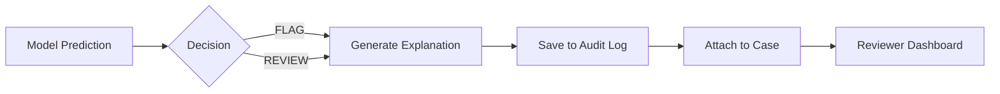

# Generating Explanations

How to produce SHAP explanations for audit and review workflows.

---

## Global Explanations

Global explanations show which features drive model predictions across the entire dataset.

### Generate Summary Plot

```python
from src.explainability.shap_global import generate_global_explanations

explanations = generate_global_explanations(
    model=xgb_model,
    X_sample=X_test.sample(500),
    output_dir="figures/"
)
```

### Output

- `shap_summary.png`: Beeswarm plot showing feature impact distribution
- `shap_importance_bar.png`: Bar chart of mean |SHAP| values

---

## Local Explanations

Local explanations show why a specific prediction was made.

### Generate for Single Case

```python
from src.explainability.shap_local import explain_single_prediction

explanation = explain_single_prediction(
    model=xgb_model,
    X=X_test,
    instance_idx=42,
    output_path="outputs/case_42_explanation.md"
)
```

### Output Format

```markdown
# Case Explanation

**Prediction**: FLAG
**Probability**: 0.73
**Confidence Band**: HIGH_RISK

## Top Contributing Features

| Feature | Value | SHAP Impact |
|---------|-------|-------------|
| PAY_0 | 2 | +0.23 |
| utilization_ratio | 0.96 | +0.12 |
| max_delay | 2 | +0.08 |
| AGE | 32 | -0.05 |

## Waterfall Plot


```

---

## Batch Explanations

Generate explanations for all REVIEW/FLAG cases:

```python
from src.explainability.shap_local import batch_explanations

results = batch_explanations(
    model=xgb_model,
    X=X_test,
    decisions=triage_results,
    output_dir="outputs/explanations/"
)

print(f"Generated {len(results)} explanation files")
```

---

## Integration with Audit Workflow



---

## Best Practices

1. **Don't show raw probability** to reviewers (reduces anchoring bias)
2. **Show confidence band** (LOW/MEDIUM/HIGH) instead
3. **Include top 5-7 features** only (cognitive load)
4. **Regenerate weekly** for global explanations (detect drift)

---

## Next Steps

- [API Reference: Explainability](../api/explainability.md)
- [Queue Mechanics](../concepts/queue.md)
