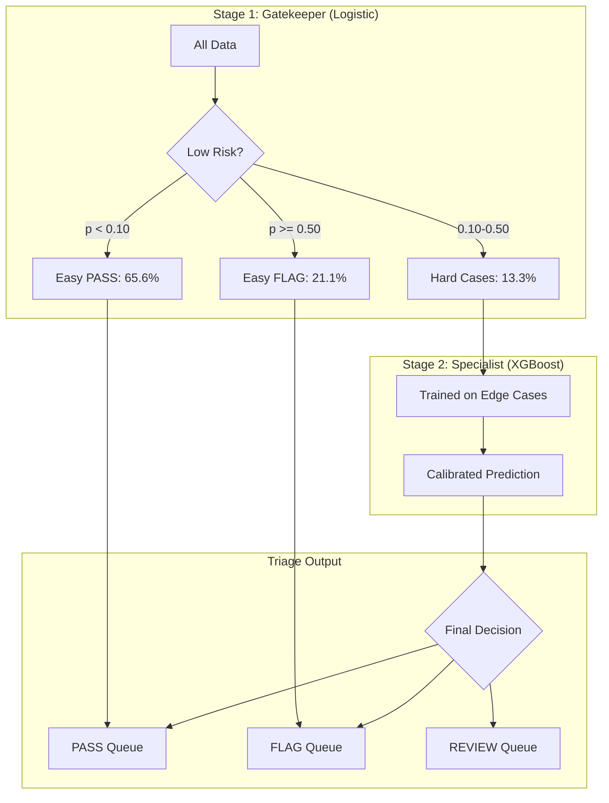
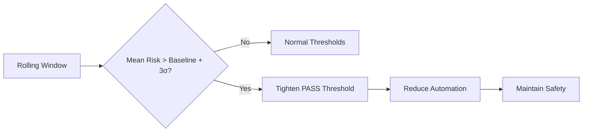

# Failure-Aware ML System

**Production-Validated Risk Engine | Cascade Architecture | 98%+ System Recall**

---

## What Is This?

A **high-recall, failure-aware classification system** for regulated environments. It takes tabular input data and outputs a three-way decision:

| Decision | Trigger | Outcome |
|----------|---------|---------|
| ✅ **PASS** | Calibrated probability < 0.10 | Auto-approved |
| ⚠️ **REVIEW** | 0.10 ≤ probability < 0.50 | Routed to human reviewer |
| 🚨 **FLAG** | Probability ≥ 0.50 | Auto-blocked |

**Key Achievement:** Validated on **1.3 Million records** (Lending Club), achieving **98.7% System Recall** while automating **67.2% of decisions**.

---

## Production Results

*Verified Feb 2, 2026 with `--cascade --dynamic-threshold`*

| Dataset | Scale | Automation | Defect Rate | Review Load | System Recall |
|---------|-------|------------|-------------|-------------|---------------|
| **Lending Club** | 1.3M | 67.2% 🟢 | 2.01% | 10.8% | 98.7% |
| **IEEE-CIS Fraud** | 590K | 90.0% 🟢 | 1.74% | 6.7% | 98.4% |
| **Home Credit** | 307K | 75.5% 🟡 | 4.46% | 24.1% | 96.6% |
| **UCI Credit** | 30K | 29.9% 🟠 | 7.80% | 57.7% | 97.7% |

> **Impact:** ~4x reduction in manual review workload vs single-model baselines.

---

## 60-Second Demo

```bash
git clone https://github.com/wilsebbis/failure-aware-ml-system.git
cd failure-aware-ml-system
uv sync
uv run python -m src.main --dataset lending_club --cascade --dynamic-threshold
```

### Expected Output

```
[6/7] Applying triage policy...
  Pass rate: 67.2%
  Flag rate: 22.0%
  Review rate: 10.8%
  Pass Queue Defect Rate: 2.01%
  System Recall: 98.7%

[7/7] Testing distribution shift...
✓ No confidence collapse (drop: 0.29%)
```

---

## Cascade Architecture

The system uses a **2-stage Gatekeeper + Specialist** design:



### Why Cascade?

| Problem | Single Model | Cascade |
|---------|-------------|---------|
| Home Credit: 76% flagged for review | ❌ Undeployable | ✅ Reduced to 24% |
| Fraud: 590K transactions to score | ❌ Heavy XGBoost on all | ✅ 96.4% cleared by fast Logistic |
| IEEE-CIS drift | ❌ Silent failure | ✅ Dynamic threshold adapted |

---

## Dynamic Threshold Safety Valve

For fraud detection and adversarial environments, enable `--dynamic-threshold`:



On IEEE-CIS, this detected a **2.05% confidence drop** and automatically tightened the acceptance criteria.

---

## Quick Links

- [Mode Selection Guide](guides/mode-selection.md) - When to use Cascade vs Dynamic
- [Threshold Derivation](concepts/thresholds.md) - How thresholds are computed
- [Running the Pipeline](guides/pipeline.md) - Full CLI reference
- [Model Card](model_card.md) - Limitations & ethics
- [Audit Report](audit_report.md) - Production validation results

---

## Project Structure

```
failure-aware-ml-system/
├── src/
│   ├── data/adapters/     # Dataset-specific loaders
│   ├── models/            # Cascade, XGBoost, Logistic
│   ├── decision_policy/   # Triage, dynamic thresholds
│   ├── evaluation/        # Metrics, calibration
│   └── explainability/    # SHAP explanations
├── docs/                  # This documentation
├── scripts/               # Data download utilities
└── data/raw/              # Downloaded datasets
```

---

## License

MIT License
