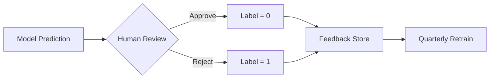

# Sentinel Risk Engine

**Audit-First Classification | Human-in-the-Loop | Asymmetric Error Optimization**

---

## What Is This?

Sentinel is a **high-recall risk scoring engine** for regulated environments. It takes tabular input data and outputs a three-way decision:

| Decision | Trigger | Outcome |
|----------|---------|---------|
| ✅ **PASS** | Calibrated probability < 0.15 | Auto-approved, no human review |
| ⚠️ **REVIEW** | 0.15 ≤ probability < 0.60 | Routed to human reviewer with SHAP explanation |
| 🚨 **FLAG** | Probability ≥ 0.60 | Auto-blocked, audit artifact generated |

This is **not** a fully automated decision system. It is designed to fail loudly—routing uncertain cases to humans rather than forcing a bad automated decision.

---

## 60-Second Demo

### Sample Payload

```json
{
  "LIMIT_BAL": 50000,
  "SEX": 2,
  "EDUCATION": 2,
  "MARRIAGE": 1,
  "AGE": 32,
  "PAY_0": 2,
  "PAY_2": 0,
  "PAY_3": 0,
  "PAY_4": 0,
  "PAY_5": 0,
  "PAY_6": 0,
  "BILL_AMT1": 48000,
  "BILL_AMT2": 45000,
  "BILL_AMT3": 42000,
  "BILL_AMT4": 40000,
  "BILL_AMT5": 38000,
  "BILL_AMT6": 36000,
  "PAY_AMT1": 2000,
  "PAY_AMT2": 1500,
  "PAY_AMT3": 1000,
  "PAY_AMT4": 1000,
  "PAY_AMT5": 1000,
  "PAY_AMT6": 1000
}
```

### Expected Output

```
Decision: FLAG
Calibrated Probability: 0.73
Confidence Band: HIGH_RISK

Top Contributing Features:
  +0.23  PAY_0 = 2 (payment delay)
  +0.12  utilization_ratio = 0.96
  +0.08  max_delay = 2
  -0.05  AGE = 32

Audit Artifact: /outputs/case_12345_explanation.md
```

### Run the Pipeline

```bash
# Clone and install
git clone https://github.com/yourusername/sentinel-risk-engine.git
cd sentinel-risk-engine
uv sync

# Run end-to-end pipeline
uv run python -m src.main
```

---

## Architecture

```mermaid
flowchart TD
    subgraph Ingestion["Data Ingestion"]
        A[Payload] -->|Schema Check| B{Valid?}
        B -->|No| X[Reject]
        B -->|Yes| C[Feature Engineering]
    end
    
    subgraph Model["Inference"]
        C --> D[XGBoost Ensemble]
        D --> E[Isotonic Calibration]
        E --> F[Calibrated P(default)]
    end
    
    subgraph Policy["Triage"]
        F --> G{Thresholds}
        G -->|p < 0.15| H[PASS]
        G -->|0.15 ≤ p < 0.60| I[REVIEW]
        G -->|p ≥ 0.60| J[FLAG]
    end
    
    subgraph Audit["Compliance"]
        I --> K[SHAP Explanation]
        J --> K
        K --> L[Audit Log]
    end
```

---

## Key Concepts

### Confidence vs. Probability

| Term | Definition | Operational Meaning |
|------|------------|---------------------|
| **Calibrated probability** | P(default=1 \| features), after isotonic regression on validation set | The score used for thresholding |
| **Confidence** | 1 − entropy of [p, 1−p], scaled to [0, 1] | Measures prediction certainty, not correctness |
| **confidence_mean** | Mean of P(positive class) across batch | Used to detect confidence collapse (< 0.70 triggers alert) |

### Calibration Error (ECE)

Expected Calibration Error with 10 equal-width bins:

```
ECE = Σ (|bin_size| / n) × |accuracy(bin) − mean_confidence(bin)|
```

We use `sklearn.calibration.calibration_curve` with `n_bins=10, strategy='uniform'`.

### Threshold Derivation

Thresholds are computed to satisfy a **False Negative Rate constraint**:

```python
def find_threshold(y_true, y_proba, max_fnr=0.005):
    """Find minimum threshold such that FNR <= max_fnr."""
    for threshold in np.linspace(0.01, 0.99, 1000):
        y_pred = (y_proba >= threshold).astype(int)
        fn = ((y_true == 1) & (y_pred == 0)).sum()
        fnr = fn / (y_true == 1).sum()
        if fnr <= max_fnr:
            return threshold
    return 0.5  # fallback
```

Current defaults were derived empirically on validation data:
- `threshold_negative = 0.15` → auto-approve ceiling
- `threshold_positive = 0.60` → auto-flag floor

---

## Explainability & Audit Artifacts

Sentinel generates explainability artifacts that **can support compliance workflows** (GDPR Right to Explanation, FCRA adverse action notices). These are audit aids, not legal compliance by themselves.

### What Gets Generated

- **Global importance** (SHAP summary): Weekly drift reports
- **Local explanations** (SHAP waterfall): Per-case audit markdown
- **Calibration curves**: Model health monitoring


---

## Feedback Loop & Retraining Governance

### How Reviewer Decisions Become Labels



### Safeguards Against Drift

| Risk | Mitigation |
|------|------------|
| **Label leakage** | Reviewer sees confidence band, not raw probability |
| **Reviewer drift** | Inter-rater reliability audits (κ ≥ 0.7 required) |
| **Distribution shift** | PSI monitoring per feature, weekly |
| **Feedback delay** | 90-day label maturation window before retrain |

### Retraining Protocol

1. **Trigger**: Quarterly, or when PSI > 0.25 on any feature
2. **Data**: Last 12 months, excluding last 90 days (label maturation)
3. **Validation**: Champion-challenger on holdout before promotion
4. **Approval**: Model Risk Committee sign-off required

---

## Project Structure

```
sentinel-risk-engine/
├── src/
│   ├── data/           # Loading, preprocessing, splitting
│   ├── models/         # Logistic, RF, XGBoost
│   ├── evaluation/     # Metrics, calibration, thresholds
│   ├── explainability/ # SHAP global & local
│   ├── decision_policy/# Three-way triage
│   └── monitoring/     # Drift detection
├── figures/            # SHAP visualizations
├── docs/               # MkDocs documentation
└── tests/              # Unit tests
```

---

## Quick Links

- [Concepts: Confidence & Calibration](concepts/confidence.md)
- [Concepts: Threshold Derivation](concepts/thresholds.md)
- [Guide: Running the Pipeline](guides/pipeline.md)
- [API Reference](api/index.md)
- [Model Card](model_card.md)

---

## License

MIT License
