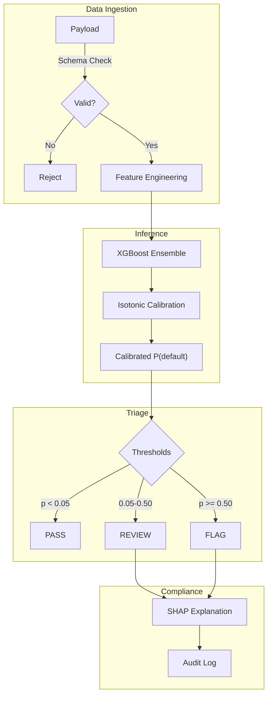
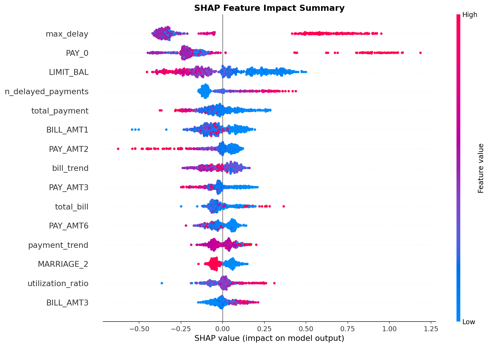
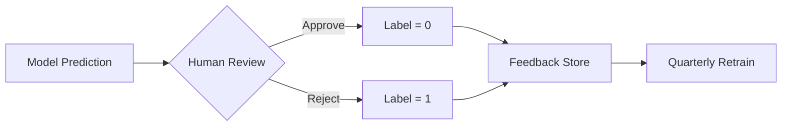

# Sentinel: Asymmetric Risk Triage System

**Fail-Safe Classification | Human-in-the-Loop | Minimize False Negatives**

---

## What Is This?

Sentinel is an **asymmetric risk triage system** for regulated environments. It takes tabular input data and outputs a three-way decision:

| Decision | Trigger | Outcome |
|----------|---------|---------|
| ✅ **PASS** | Calibrated probability < 0.05 | Auto-approved, no human review |
| ⚠️ **REVIEW** | 0.05 ≤ probability < 0.50 | Routed to human reviewer with SHAP explanation |
| 🚨 **FLAG** | Probability ≥ 0.50 | Auto-blocked, audit artifact generated |

This is **not** a fully automated decision system. It is designed to fail loudly—routing uncertain cases to humans rather than forcing a bad automated decision.

> **Demo Dataset**: This repo uses the [UCI Credit Card Default](https://archive.ics.uci.edu/dataset/350/default+of+credit+card+clients) dataset for reproducibility. The architecture is dataset-agnostic.

---

## 60-Second Demo

### Sample Payload

```json
{
  "LIMIT_BAL": 50000,
  "SEX": 2,
  "EDUCATION": 2,
  "MARRIAGE": 1,
  "AGE": 32,
  "PAY_0": 2,
  "PAY_2": 0,
  "PAY_3": 0,
  "PAY_4": 0,
  "PAY_5": 0,
  "PAY_6": 0,
  "BILL_AMT1": 48000,
  "BILL_AMT2": 45000,
  "BILL_AMT3": 42000,
  "BILL_AMT4": 40000,
  "BILL_AMT5": 38000,
  "BILL_AMT6": 36000,
  "PAY_AMT1": 2000,
  "PAY_AMT2": 1500,
  "PAY_AMT3": 1000,
  "PAY_AMT4": 1000,
  "PAY_AMT5": 1000,
  "PAY_AMT6": 1000
}
```

### Expected Output

```
Decision: FLAG
Calibrated Probability: 0.73
Confidence Band: HIGH_RISK

Top Contributing Features:
  +0.23  PAY_0 = 2 (payment delay)
  +0.12  utilization_ratio = 0.96
  +0.08  max_delay = 2
  -0.05  AGE = 32

Audit Artifact: /outputs/case_12345_explanation.md
```

### Run the Pipeline

```bash
# Clone and install
git clone https://github.com/wilsebbis/sentinel-risk-engine.git
cd sentinel-risk-engine
uv sync

# Run end-to-end pipeline
uv run python -m src.main
```

---

## Architecture



---

## Key Metrics: Safety First Calibration

The model struggled to cleanly separate middle-risk cases (common with this dataset). Rather than forcing bad automated decisions, we tuned the **PASS threshold aggressively low** (p < 0.05).

### The Critical Metric: Pass Queue Defect Rate

| Metric | Value | Meaning |
|--------|-------|--------|
| **Pass Queue Defect Rate** | 1.8% | Only 1.8% of auto-approved cases are actual defaults |
| System Recall (FLAG + REVIEW) | 98.2% | 98% of defaults go to human eyes |

### Triage Distribution

| Queue | Volume | Contains |
|-------|--------|----------|
| ✅ PASS | 18% | Safe cases only (1.8% defect rate) |
| ⚠️ REVIEW | 68% | Uncertain cases → human decision |
| 🚨 FLAG | 14% | High-risk → auto-blocked |

> **Design Philosophy**: We accept higher review volume in exchange for a pristine PASS queue. The 1.8% defect rate means automation only touches cases we're confident about.

### Threshold Derivation

Thresholds are computed to minimize **Pass Queue Defect Rate**:

```python
def find_safe_pass_threshold(y_true, y_proba, max_defect_rate=0.02):
    """Find maximum threshold such that defect rate in PASS queue <= max_defect_rate."""
    for threshold in np.linspace(0.01, 0.20, 100):
        pass_mask = y_proba < threshold
        if pass_mask.sum() == 0:
            continue
        defect_rate = y_true[pass_mask].mean()
        if defect_rate <= max_defect_rate:
            return threshold
    return 0.05  # conservative fallback
```

Current thresholds:
- `threshold_pass = 0.05` → auto-approve ceiling
- `threshold_flag = 0.50` → auto-block floor

---

## Explainability & Audit Artifacts

Sentinel generates explainability artifacts that **can support compliance workflows** (GDPR Right to Explanation, FCRA adverse action notices). These are audit aids, not legal compliance by themselves.

### What Gets Generated

- **Global importance** (SHAP summary): Weekly drift reports
- **Local explanations** (SHAP waterfall): Per-case audit markdown
- **Calibration curves**: Model health monitoring



---

## Feedback Loop & Retraining Governance

### How Reviewer Decisions Become Labels



### Safeguards Against Drift

| Risk | Mitigation |
|------|------------|
| **Label leakage** | Reviewer sees confidence band, not raw probability |
| **Reviewer drift** | Inter-rater reliability audits (κ ≥ 0.7 required) |
| **Distribution shift** | PSI monitoring per feature, weekly |
| **Feedback delay** | 90-day label maturation window before retrain |

### Retraining Protocol

1. **Trigger**: Quarterly, or when PSI > 0.25 on any feature
2. **Data**: Last 12 months, excluding last 90 days (label maturation)
3. **Validation**: Champion-challenger on holdout before promotion
4. **Approval**: Model Risk Committee sign-off required

---

## Project Structure

```
sentinel-risk-engine/
├── src/
│   ├── data/           # Loading, preprocessing, splitting
│   ├── models/         # Logistic, RF, XGBoost
│   ├── evaluation/     # Metrics, calibration, thresholds
│   ├── explainability/ # SHAP global & local
│   ├── decision_policy/# Three-way triage
│   └── monitoring/     # Drift detection
├── figures/            # SHAP visualizations
├── docs/               # MkDocs documentation
└── tests/              # Unit tests
```

---

## Quick Links

- [Concepts: Confidence & Calibration](concepts/confidence.md)
- [Concepts: Threshold Derivation](concepts/thresholds.md)
- [Guide: Running the Pipeline](guides/pipeline.md)
- [API Reference](api/index.md)
- [Model Card](model_card.md)

---

## License

MIT License
